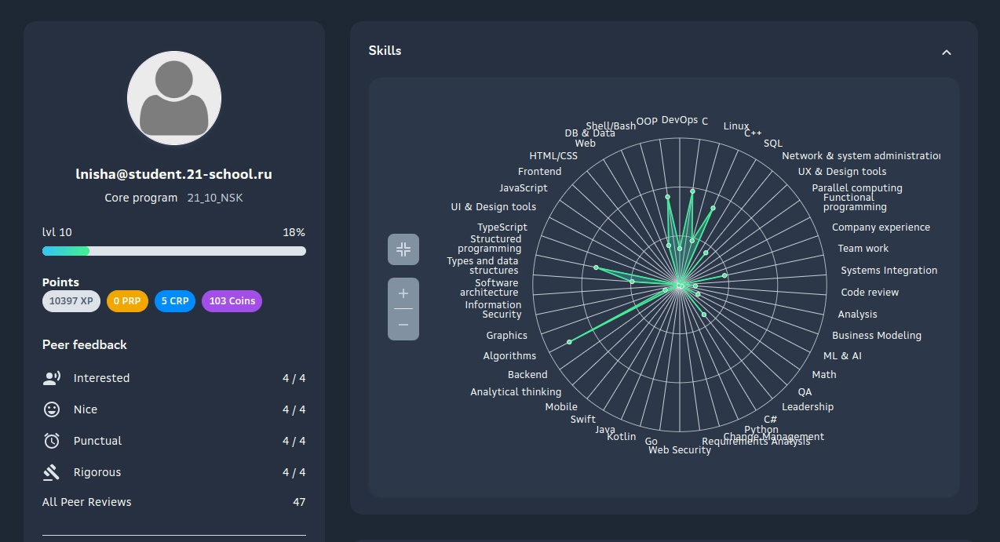

<h3 align="left">🔥 Всем пламенный привет</h3>

* Меня зовут Альхимович Михаил Валерьевич, 22 года, начинающий программист из России, город Новосибирск. 

* Тружусь в компании "ПРОТЕЙ-ЛАБ" на должности младшего разработчика в отделе backend-разработки.

* В ближайщее время планирую расширять и углублять свои знания в облостях: сетевого программирования, разработки высоконагруженных систем, разработки на python, машинного обучения.

* Занимаюсь спортом и играю на гиатре 🗿

<h3 align="left">💻 Мои метрики Github:</h3>

---
###

<h3 align="left">🛠 Технологии:</h3>

---

###

  
  
  
  

###

<h3 align="left">🧠 Пройденные курсы, образование:</h3>

---
🎓 Бакалавриат СибГУТИ по направлению "Информатика и вычислительная техника": 01.09.2020 - 27.07.2024

🏊‍♂️ Бассейн "Школы 21" по ЯП C: xx.09.2021 - xx.09.2021

💪 Основная программа "Школы 21" по ЯП С/С++: xx.10.2021 - xx.12.2022

🐣 КМБ компании "ПРОТЕЙ-ЛАБ": 11.04.2023 - 15.08.2024

